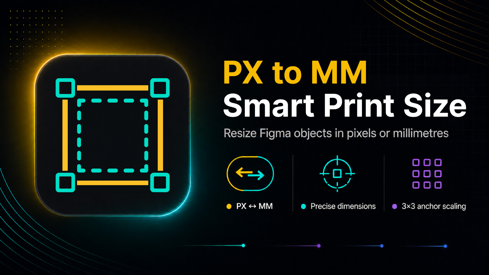

<a id="top" name="top"></a>

# 📐 PX to MM — Smart Print Size

<p align="center">
  
  
  
  
</p>

<p align="center">
  
</p>

<a id="languages" name="languages"></a>
<p align="center">
  <b>Language / Язык:</b><br/>
  <a href="#english">🇬🇧 English</a> &nbsp;•&nbsp; <a href="#russian">🇷🇺 Русский</a>
</p>

---

<a id="english" name="english"></a>

## 🇬🇧 English

**PX to MM — Smart Print Size** is a compact Figma property panel for inspecting and editing the geometry of one selected object. It keeps the source geometry precise while providing a practical millimeter view, proportional scaling, and stroke-aware dimensions.

### Features

- **Dimensions panel:** edit width and height of the selected object in `mm` or `px`; millimeters are the default display unit.
- **Fixed Figma conversion:** the plugin uses Figma's 72 PPI coordinate system:
  ```text
  mm = px × 25.4 / 72
  px = mm × 72 / 25.4
  ```
- **Native aspect-ratio lock:** use Figma's own aspect-ratio state. When it is enabled, editing one dimension updates the other dimension proportionally.
- **Stroke-aware dimensions:** choose whether the displayed size includes the visible part of a center/outside stroke painted beyond the geometry contour. The `Included` / `Excluded` choice affects the displayed and edited dimensions, not the node's stroke alignment.
- **Canvas stroke guide:** with `Included` selected, a temporary locked, fill-free scene rectangle marks the visible outer boundary for exact center/outside stroke geometry. It follows the selected node and keeps a stable on-screen stroke while zoom changes.
- **Stroke editing:** edit a uniform visible stroke weight in the current unit when Figma exposes it as a single value. Hidden, mixed, or unavailable stroke data is kept safe and disables only the relevant control.
- **Scale panel:** the current width and height are shown read-only, while a custom scale or a preset applies uniform scaling around a 3×3 anchor point.
- **Scale presets:** `0.25x`, `0.5x`, `1x`, `1.5x`, `2x`, `3x`, and `4x`; custom values from `0.01` are accepted, including values written as `2` or `2x`.
- **Selection-aware behavior:** the panel remains visible for an empty or multiple selection, but editing controls are disabled until exactly one object is selected.
- **Figma-safe capability checks:** locked objects, direct Auto Layout child positions, text with missing fonts, unsupported aspect-ratio states, and unavailable geometry are detected before an edit is applied.
- **Image-fill compatibility:** visible `IMAGE` fills are detected through Figma's native image API without replacing the original fill or changing the object's geometry.
- **UI3-style controls:** the panel follows the local UI3 token layer, supports Figma light/dark theme colors, and provides keyboard navigation for scale and stroke menus.
- **Offline runtime:** the manifest declares no network domains, and the Inter font files used by the UI are bundled locally.

### How values behave

- Geometry calculations keep full floating-point precision. The panel formats values to a maximum of two decimal places only for display.
- Both `.` and `,` are accepted as decimal separators. Intermediate text can be completed without an error flash; valid values are applied while editing.
- Press `Enter` to commit the current field. Press `Escape` to restore the last displayed value.
- Dimensions and stroke weight cannot be reduced below `0.01 px`; stroke weight itself cannot be negative.
- The scale factor must be at least `0.01`. The selected anchor stays fixed when Figma allows the object's position to move; Auto Layout remains controlled by Figma.

### Supported objects and limitations

The plugin works with scene nodes that expose valid geometry and Figma's resize/rescale APIs, including frames, groups, vectors, shapes, text, lines, and image-filled objects.

The following behavior is intentional:

- Only one object can be edited at a time.
- A direct child positioned by Auto Layout cannot have its position changed from this panel.
- Locked objects and locked ancestors cannot be edited.
- A text node with a missing font cannot be resized or scaled until the font is available.
- Aspect-ratio locking is unavailable for lines and for text whose sizing mode is controlled by Figma.
- A stroke with mixed per-side or per-vertex weights cannot be edited through the single Stroke field.
- The canvas stroke guide is an additional scene node, not Figma's native selection overlay. Figma's native blue outline remains visible; its behavior in Layers, Undo, export, and multiplayer should be checked manually in the target Figma runtime.
- If image dimensions are temporarily unavailable, the object remains editable and its original fill is preserved.

### Install and run in Figma

```bash
git clone https://github.com/tenebrius-dev/PX-to-MM-Smart-Print-Size.git
cd PX-to-MM-Smart-Print-Size
npm install
npm run build
```

Then open Figma Desktop and choose **Plugins → Development → Import plugin from manifest…**. Select `manifest.json` from the project root and run **PX to MM — Smart Print Size**.

### Development commands

| Command | Purpose |
| --- | --- |
| `npm test` | Run the Vitest test suite once. |
| `npm run test:watch` | Run Vitest in watch mode. |
| `npm run typecheck` | Type-check the application and plugin code. |
| `npm run lint` | Run Oxlint on the application configuration and source entry points. |
| `npm run ui3:validate` | Validate the bundled UI3 design-system snapshot. |
| `npm run build` | Build the single-file UI and bundle the Figma plugin entry point into `dist/`. |
| `npm run dev` | Start the Vite development server for UI work. |

For a release-quality local check, run:

```bash
npm test
npm run typecheck
npm run lint
npm run ui3:validate
npm run build
```

### Project structure

```text
manifest.json                 Figma plugin manifest
src/plugin/code.ts            Figma main-thread entry point and edit handlers
src/plugin/selection.ts       Selection snapshots and capability state
src/plugin/raster.ts          Native image-fill inspection
src/domain/units.ts            px ↔ mm conversion and input validation
src/domain/geometry.ts         Dimension editing and minimum-size rules
src/domain/stroke-bounds.ts    Visible stroke expansion rules
src/domain/scale.ts            Uniform scaling and 3×3 anchors
src/plugin/overlay-controller.ts Temporary canvas stroke guide
src/ui/App.tsx                 Property-panel composition and state
src/components/                Inputs, menus, lock, anchor, and UI controls
design-system/ui3/             Local UI3 tokens, primitives, and icons
dist/                           Generated build output (ignored by Git)
```

### Technology

- React 19 and TypeScript
- Vite, `vite-plugin-singlefile`, and esbuild
- Vitest and Testing Library
- Local UI3 tokens and primitives under `design-system/ui3`
- Figma Plugin API manifest with `networkAccess.allowedDomains: ["none"]`

### Release

The current documented release is **1.4.0**. See [CHANGELOG.md](./CHANGELOG.md) for the release note.

<p align="right">
  <a href="#top">⬆ Back to Top</a>
</p>

---

<a id="russian" name="russian"></a>

## 🇷🇺 Русский

**PX to MM — Smart Print Size** — компактная панель свойств Figma для просмотра и редактирования геометрии одного выделенного объекта. Плагин сохраняет исходную точность геометрии и добавляет удобное отображение в миллиметрах, пропорциональное масштабирование и расчёт размеров с учётом обводки.

### Возможности

- **Панель Dimensions:** изменение ширины и высоты выделенного объекта в `mm` или `px`; по умолчанию показываются миллиметры.
- **Фиксированный пересчёт Figma:** плагин использует координатную систему Figma с 72 PPI:
  ```text
  mm = px × 25,4 / 72
  px = mm × 72 / 25,4
  ```
- **Нативная блокировка пропорций:** используется собственное состояние aspect ratio Figma. При включённой блокировке изменение одной стороны пропорционально пересчитывает вторую.
- **Размер с учётом обводки:** можно выбрать, включать ли в отображаемый размер видимую часть центральной/внешней обводки, выходящую за геометрический контур. Выбор `Included` / `Excluded` влияет на отображаемый и редактируемый размер, но не меняет выравнивание обводки.
- **Canvas-подсветка обводки:** в режиме `Included` временный заблокированный scene-объект без заливки показывает видимую внешнюю границу при точной геометрии центральной/внешней обводки. Он следует за выделенным объектом и сохраняет видимую толщину линии при изменении масштаба просмотра.
- **Редактирование обводки:** единая видимая толщина обводки доступна для изменения в текущей единице, если Figma предоставляет её одним значением. Скрытая, смешанная или недоступная информация безопасно отключает только соответствующий контрол.
- **Панель Scale:** текущие ширина и высота показываются только для чтения; пользовательский коэффициент или пресет применяет равномерное масштабирование вокруг якоря 3×3.
- **Пресеты масштаба:** `0.25x`, `0.5x`, `1x`, `1.5x`, `2x`, `3x` и `4x`; доступны произвольные значения от `0.01`, в том числе в формате `2` или `2x`.
- **Поведение по выделению:** панель остаётся видимой при пустом или множественном выделении, но поля блокируются до выбора ровно одного объекта.
- **Проверки возможностей Figma:** до изменения определяются заблокированные объекты, позиции прямых детей Auto Layout, отсутствующие шрифты в тексте, неподдерживаемые состояния aspect ratio и недоступная геометрия.
- **Совместимость с IMAGE-заливками:** видимые заливки `IMAGE` определяются через нативный API Figma; исходная заливка и геометрия объекта не заменяются.
- **Контролы в стиле UI3:** панель использует локальный слой UI3-токенов, поддерживает цвета светлой/тёмной темы Figma и клавиатурную навигацию в меню масштаба и обводки.
- **Работа без сети:** в манифесте не разрешены сетевые домены, а используемые интерфейсом файлы шрифта Inter поставляются локально.

### Как обрабатываются значения

- Расчёты геометрии выполняются с полной точностью чисел с плавающей запятой. До двух знаков округляется только отображение в панели.
- В качестве разделителя дробной части принимаются и `.` и `,`. Промежуточный текст можно допечатать без мигания ошибки; корректные значения применяются во время ввода.
- Нажмите `Enter`, чтобы зафиксировать текущее поле. Нажмите `Escape`, чтобы вернуть последнее отображавшееся значение.
- Размеры и толщина обводки не могут быть меньше `0,01 px`; толщина обводки не может быть отрицательной.
- Коэффициент масштаба должен быть не меньше `0,01`. Выбранный якорь сохраняется неподвижным, если Figma разрешает перемещение объекта; позиция Auto Layout остаётся под управлением Figma.

### Поддерживаемые объекты и ограничения

Плагин работает с объектами сцены, у которых есть корректная геометрия и API Figma для изменения размера/масштаба: с фреймами, группами, векторами, фигурами, текстом, линиями и объектами с заливкой `IMAGE`.

Предусмотрены следующие ограничения:

- Одновременно редактируется только один объект.
- Позиция прямого ребёнка, управляемого Auto Layout, не изменяется из панели.
- Заблокированные объекты и объекты с заблокированным предком не редактируются.
- Текст с отсутствующим шрифтом нельзя изменять по размеру или масштабу до восстановления шрифта.
- Блокировка пропорций недоступна для линий и для текста, размер которого управляется режимом Figma.
- Обводка со смешанной толщиной по сторонам или вершинам не редактируется через единое поле Stroke.
- Canvas-подсветка — это дополнительная scene-нода, а не нативная рамка выделения Figma. Нативная синяя рамка остаётся видимой; поведение этой ноды в Layers, Undo, экспорте и multiplayer нужно отдельно проверить в целевой версии Figma.
- Если размеры изображения временно недоступны, объект остаётся редактируемым, а исходная заливка сохраняется.

### Установка и запуск в Figma

```bash
git clone https://github.com/tenebrius-dev/PX-to-MM-Smart-Print-Size.git
cd PX-to-MM-Smart-Print-Size
npm install
npm run build
```

Затем откройте Figma Desktop и выберите **Plugins → Development → Import plugin from manifest…**. Укажите `manifest.json` в корне проекта и запустите **PX to MM — Smart Print Size**.

### Команды разработки

| Команда | Назначение |
| --- | --- |
| `npm test` | Однократный запуск тестов Vitest. |
| `npm run test:watch` | Запуск Vitest в режиме наблюдения. |
| `npm run typecheck` | Проверка типов приложения и кода плагина. |
| `npm run lint` | Запуск Oxlint для конфигурации и основных исходных файлов. |
| `npm run ui3:validate` | Проверка локального снимка дизайн-системы UI3. |
| `npm run build` | Сборка UI в один файл и бандлинг entry point плагина в `dist/`. |
| `npm run dev` | Запуск Vite-сервера для работы над UI. |

Для локальной проверки, близкой к релизной, выполните:

```bash
npm test
npm run typecheck
npm run lint
npm run ui3:validate
npm run build
```

### Структура проекта

```text
manifest.json                 Манифест плагина Figma
src/plugin/code.ts            Entry point main-thread и обработчики изменений
src/plugin/selection.ts       Снимки выделения и состояние возможностей
src/plugin/raster.ts          Проверка IMAGE-заливок через нативный API
src/domain/units.ts            Пересчёт px ↔ mm и проверка ввода
src/domain/geometry.ts         Изменение размеров и минимальный размер
src/domain/stroke-bounds.ts    Правила видимого расширения обводки
src/domain/scale.ts            Равномерный масштаб и якоря 3×3
src/plugin/overlay-controller.ts Временная canvas-подсветка обводки
src/ui/App.tsx                 Компоновка и состояние панели свойств
src/components/                Поля, меню, замок, якорь и UI-контролы
design-system/ui3/             Локальные токены, примитивы и иконки UI3
dist/                           Результат сборки (исключён из Git)
```

### Технологии

- React 19 и TypeScript
- Vite, `vite-plugin-singlefile` и esbuild
- Vitest и Testing Library
- Локальные UI3-токены и примитивы в `design-system/ui3`
- Манифест Figma Plugin API с `networkAccess.allowedDomains: ["none"]`

### Релиз

Текущая документированная версия — **1.4.0**. История релиза приведена в [CHANGELOG.md](./CHANGELOG.md).

<p align="right">
  <a href="#top">⬆ Наверх</a>
</p>

---

## 📄 License / Лицензия

License information is not included in the current repository metadata.

Информация о лицензии пока не включена в метаданные репозитория.
